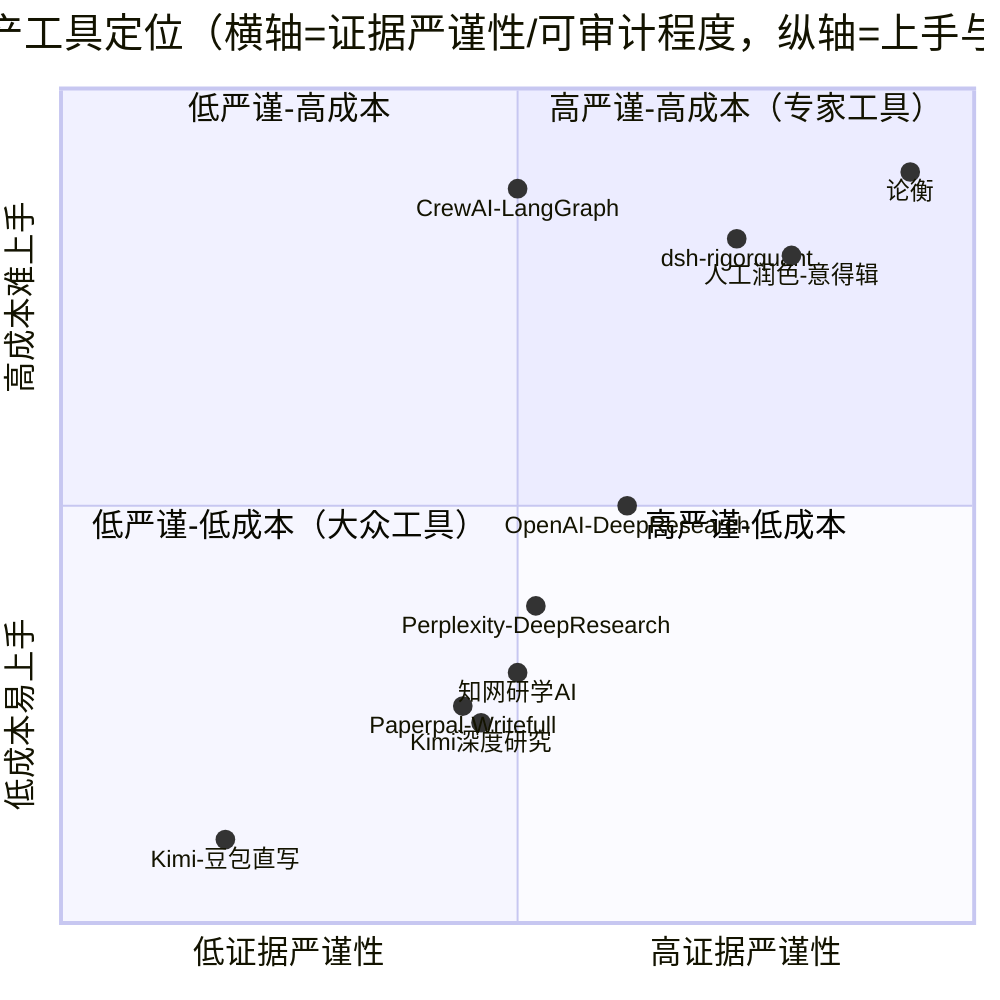

# 产品分析报告 — 论衡（lunheng-article-pipeline）

> **分析对象**：`lunheng-article-pipeline`（DSH bundle 插件，MIT，作者 zuoyunlai）  
> **分析版本**：仓库工作副本 `18.62.5`（`package.json:3`）；npm 已发布最新 = `18.62.4`（`npm view` 实测，2026-10-02）  
> **分析日期**：2026-10-02  
> **分析性质**：**产品级分析（只读）**——不做新功能 PRD，回答「值不值得用 / 谁用得上 / 门槛多高 / 与替代方案比在哪 / 下一步做什么」。  
> **方法**：通读仓库产品事实源（README 五语 / docs / SKILL.md / QUICKSTART / package.json / CHANGELOG 抽样 / audits 抽样）+ 联网竞品调研 + npm/GitHub 公开数据实测。**未运行任何写盘脚本，未修改任何源码。**

---

## §0 分析方法与范围

### 0.1 事实来源与证据纪律

| 类别     | 来源                                                                                                                                                     | 引用方式             |
| ------ | ------------------------------------------------------------------------------------------------------------------------------------------------------ | ---------------- |
| 论衡自身事实 | `README.md` / `README-zh.md` / `docs/*` / `skills/**/SKILL.md` / `package.json` / `CHANGELOG.md` / `audits/*` / `skills/**/references/case-studies.md` | 一律给 `文件:行号` 或章节名 |
| 竞品事实   | 联网搜索（结果见 §4 每条的「来源」）                                                                                                                                   | 给来源链接；无法核实标「未核实」 |
| 分发数据   | `npm view` / `api.npmjs.org` / GitHub REST API                                                                                                         | 标「实测」并注明时间与口径    |

**本报告严格区分两类表述**：

- 「**文档这么写**」＝ 仓库自述，可核对；
- 「**我判断**」/「**推断**」＝ 分析者判断，不可当事实引用。

### 0.2 范围界定

- ✅ 覆盖：定位与价值主张、目标用户、用户旅程与上手摩擦、竞品、定位象限、产品级需求池、待确认问题。
- ❌ 不覆盖（分工见 §7）：`lib/**` 代码级缺陷、模块耦合、SSOT 派生、退出码语义、测试金字塔——这些是同日两份技术评审的领地。

### 0.3 关键数据实测（2026-10-02）

| 指标                            | 值                       | 口径/来源                                         | 解读                                                         |
| ----------------------------- | ----------------------- | --------------------------------------------- | ---------------------------------------------------------- |
| npm `latest` / `dsh` dist-tag | `18.62.4` / `18.62.4`   | `npm view lunheng-article-pipeline dist-tags` | **仓库文档已写 18.62.5，但 npm 只到 18.62.4** → 文档领先于已发布物（见 §3.2 F2） |
| npm 月下载                       | 23 537（2026-09）         | `api.npmjs.org/downloads/point/last-month`    | ⚠️ 与 7 stars 严重不符，**极大概率含镜像/爬虫噪声，不可当用户数**                  |
| npm 周下载                       | 16 945（09-24~09-30）     | 同上 `last-week`                                | 同上，仅作原始记录                                                  |
| GitHub star / fork / issue    | **7 / 0 / 2 open**      | GitHub API 实测                                 | **产品上线约 1.5 个月，社区基本为零**（见 §2.5、§6 P2-1）                    |
| 仓库创建 / 最后 push                | 2026-08-17 / 2026-10-01 | GitHub API                                    | 迭代极其活跃，受众极其稀少                                              |
| `audits/` 报告数                 | 101 项                   | `ls audits/ \| wc -l`                         | 「自我审计密度」远高于「外部使用密度」                                        |
| CHANGELOG 规模                  | 772 KB / 5596 行         | `ls -la`、架构评审 §0                              | 文档体量与用户量严重倒挂                                               |

> **一句话数据画像**：这是一个**作者自用的、被高频自我审计驱动的、外部采用尚在个位数的早期产品**。这决定了后面所有判断的基调——它目前的价值主张是「**自己写东西时够用**」，而不是「**一个已成型的产品**」。

---

## §1 一句话定位与价值主张

### 1.1 一句话定位（分析者判断，非 README 复述）

> **论衡是装在 DeepSeek Harness 上、面向中文深度长文的「可审计交付流水线」——它卖的不是写得更快，而是「把一篇稿子的可信度做成一本人人能查的账」。**

依据（论衡自述，非我的措辞）：

- 「Lunheng is a writing pipeline, **not a text generator**」（`README.md:11`）；
- 「把深度长文的生产……变成**带人在环节点的 9 角色流水线**」（`README-zh.md:7`）；
- 核心机制三件套：**三角证据底座**（`[L]`+`[D]`+`[C]`）、**独立审计**（审计员只审不改）、**M 门机械终检 exit 0 才交付**（`README.md:65`、`README-zh.md:65`）。

### 1.2 它到底卖什么：更快，还是更经得起质疑？

**我的判断：卖的是「写得经得起质疑」，代价是「慢」。** 三条依据：

**① 时效上它明确放弃「快」。**

- 适用条件自述「可接受 **1–3 小时**流水线时长」（`README.md:17`）；
- 但更接近真相的自述在技能体：**「17 个有效项目里 8 个跨度 ≥8 h、另 8 个 ≤4 h——故不给小时区间」**（`SKILL.md:144`）。
- 所以「更快」在论衡身上不成立——同一 README 的 Known limitations 也承认「**审计独立性有成本**：一次完整运行会派 15+ 个子代理，**大部分 token 花在上下文读取而非生成**」（`README-zh.md:205`）。

**② 它把全部工程投入押在「可核验」上。** 交付物清单（`README-zh.md:35-44`）里，一半是**审阅/证据类产物**：文献卡 A/B/C 分级、数据卡「冲突数字并列」、批判报告 C1–C7、审计报告 G0–G14、审稿报告 6 维度、AI 痕迹报告、M 门报告、证据包（含 sha256 `manifest.json`）。

**③ 用 6 篇真实交付记录验证增量。** README 的 Verification status 表（`README-zh.md:188-197`）是**唯一可核的外部成绩单**：

| 文章             | 规模                              | 关键结果（原文）                   |
| -------------- | ------------------------------- | -------------------------- |
| 原创性悖论（2026-08） | ~9500 字 / 12 文献 + 34 数据 + 6 案例  | 全程 4 轮修订，**A- 评级，已发表**     |
| 教师场域隔离论文       | ~12000 字 / 18 文献 + 47 数据 + 9 案例 | 审计第 2 轮通过                  |
| 品牌一致性          | ~7900 字 / 15 文献 + 54 数据         | 8 项审计问题**全部关闭**            |
| 甲醛白菜           | ~4200 字 / 12 文献 + 29 数据 + 4 案例  | M 门 exit 0；并入 6 条反哺规则      |
| 观念与理念哲学论文      | ~6280 字 / 18 文献 + 15 数据         | 2 轮审计，23/30 minor revision |
| 生成式 AI 学生写作评论  | ~2000 字 / 12 文献 + 26 数据         | 三方并行检索，M 门 exit 0          |

> ⚠️ **读表纪律（README 自己提示，务必保留）**：该表是「**当时那一次跑的历史值**，用**当前脚本无法复现**」——今天重跑甲醛白菜会得 `exit 2` + 5 个 P0，因为其中三项门是那篇之后才加的（`README.md:197`）。所以**它不是「可复现的基准」，是「作者的履历」**。

### 1.3 相对「直接用最强模型聊」，1–3 小时 + 15+ subagent 换来了什么

**可说清的增量（有实录支撑，非推断）**：

| 增量          | 实录证据                                                                                               |
| ----------- | -------------------------------------------------------------------------------------------------- |
| **幻觉/编造拦截** | 审计升级机制：抓到假引用「**升级 P0 并全量核验**」（`docs/introduction.md:63` G1 分级核验 C 级 100%/B≥50%/A≥10%）              |
| **口径冲突暴露**  | 实战抓到「剂量层数量级断言与天然本底 1-90 mg/kg 冲突」的**逻辑断裂 P0**（`docs/introduction.md:141`）                          |
| **二手报道纠偏**  | 实战「三次炮轰」实为「**两年五次**」，主动检索发现媒体口径有误（`skills/**/references/case-studies.md:59` 区）                     |
| **无主数据拦截**  | 案例 5：「T8 抓出无主数据；T5 抓出元数据泄漏」（`case-studies.md` 案例索引表）                                               |
| **防重复原创**   | 先行者清单 + G7 原创性审计（重复未声明 = P0）（`docs/introduction.md:64`）                                            |
| **可核验交付**   | `final/证据包/manifest.json`（sha256）+ `M-Gate-Report.json`（含 `script_exit_raw` 原值防篡改）（`SKILL.md:116`） |

**说不清 / 未被证明的**：

- **省不省 token 没有实测结论**。`docs/troubleshooting.md:215-226` 只给了两个**口径互不相同**的数字（76% 是单项目峰值、63.6% 是本机 34 个会话聚合值），并明说「引用时必须写口径」。**没有「论衡 vs 直接聊」的成本对照实验**。
- **质量提升没有对照实验**。「A- 已发表」是单篇结果，**无法归因于流水线**（作者本人的写作能力、选题质量、审稿运气都是变量）。

> **小结（判断）**：论衡换来的是**过程可核验性**（citation/claim/audit 三层留痕），不是**结果必然更好**。对「会自己核稿、本来就不编数据」的资深作者，增量可能很小；对「一次性让模型写完就发」的人，增量来自**被强制暴露的问题清单**——但这份清单值不值 1–8 小时，取决于稿子要去哪（发表/上会/发公众号）。

---

## §2 目标用户画像

### 2.1 候选用户排序（分析者判断）

**排序依据**：① 对「可核验」的真实需求强度；② 是否具备装 DSH 的技术能力；③ 是否接受 1–8 小时等待；④ 付费意愿 vs 替代方案成本。

| 排序             | 用户类                                | 核心场景                                   | 当前替代方案                                                               | 付费意愿                          | 愿意等 1–8h？         | 会装 DSH？                    | 综合           |
| -------------- | ---------------------------------- | -------------------------------------- | -------------------------------------------------------------------- | ----------------------------- | ----------------- | -------------------------- | ------------ |
| **P0 真需求**     | **① 中文学术写作者**（人文社科研究生 / 青年教师 / 博士） | 投稿前把稿子的**证据链、反方论证、可复现性、期刊匹配、AI 痕迹**过一遍 | 知网研学 AI（免费/机构授权）、Paperpal（~$25/月）、人工润色（0.42–1.99 元/词）、导师/同行预审（免费但难约） | **中**（愿为润色付费，但对比 0.42 元/词会算账） | **是**（写论文本就是数周级）  | **偏低**（需装 DSH+pnpm+Node22） | ⭐⭐⭐⭐         |
| **P1 强需求·高门槛** | **② 行业分析师 / 研究员**（咨询、券商、企业战略）      | 出具「上下都能核」的行业分析/尽调报告                    | OpenAI Deep Research（$20–200/月）、Perplexity（$20/月）、内部知识库+人工           | **高**（机构工具预算）                 | **是**（报告周期以天计）    | **需 IT/合规批准**（数据外发是拦路虎）    | ⭐⭐⭐          |
| **P2 有需求·低付费** | **③ 深度内容作者 / 自媒体**（公众号长文、商业评论）     | 写「不像 AI 写的」深度长文，规避 AI 味                | Kimi（免费）、豆包（免费）、秘塔写作猫（24–48 元/月）、直接聊 ChatGPT                         | **低**（替代品大量免费）                | **可能否**（公众号有热点时效） | **低**（非技术写作者）              | ⭐⭐           |
| **P3 边缘**      | **④ 企业战略/公关内容团队**                  | 需要一致性 + 可审计的内容生产                       | 内部流程 + 外部乙方                                                          | 高（但走采购）                       | 是                 | 需部署支持                      | ⭐⭐（要产品化/私有化） |
| **P4 间接**      | **⑤ 内容审校 / 编辑 / 期刊编辑助理**           | 把论衡的 C1–C7 / G0–G14 报告当**审校清单**用       | 自己列 checklist                                                        | 低                             | 不涉及               | 低                          | ⭐            |

### 2.2 逐类展开（含「是否真愿等」「是否真有能力装」）

**① 中文学术写作者（我判断这是唯一「产品与用户双向匹配」的客群）**

- 论衡的**设计定位就是中文**：「中文学术/深度长文专用流水线（G14 中文 AI 痕迹闸 / GB/T 7714-2015 / Top 3 中文期刊 / 中文新闻源）」（`SKILL.md:142`）。GB/T 7714 和中文期刊库是**专门为这个客群做的**。
- 痛点对位准确：学术写作痛点正是「引用悬空、重复选题、无独立挑错」（`docs/introduction.md:11-18`）。
- **但门槛把大部分目标用户挡在外面**：目标用户通常不装 Node 22 / pnpm / DSH（见 §3.1 F1）。
- **付费对比**：人工润色 0.42–1.99 元/词（意得辑，见 §4 来源），一篇 8000 词论文 ≈ 3400–16000 元；论衡 MIT 免费 + 自付 token。**结论：学术用户对论衡的「价格」不敏感，对「门槛」和「效果不确定性」敏感。**

**② 行业分析师 / 研究员**

- 论衡适用条件「题材涉及事实、数据或多方观点，需要证据底座而非纯观点输出」（`README.md:18`）正是分析报告的画像。
- **付费意愿最高**（机构愿为效率付费），但**数据外发合规**是硬约束：论衡默认会把「文献/数据/案例卡、大纲、初稿」发给模型 provider（`README-zh.md:176-184`）。企业敏感题材会卡在合规。
- 替代方案（Deep Research / Perplexity）**已经内建在他们的工作流里**，且**更快**（Perplexity 平均 2–4 分钟，见 §4）。

**③ 深度内容作者 / 自媒体**

- 论衡的 6 篇交付记录里，多数是**这一类的题材**（品牌一致性、甲醛白菜、生成式 AI 学生写作评论）——说明**作者本人的真实使用场景就是这一类**。
- 但**付费意愿最低**：Kimi 免费就能出「万字、约 26 个可溯源信源」的报告（见 §4）。
- **对 G14「中文 AI 痕迹闸」的偏好**可能是这类用户的**唯一差异化吸引点**（`SKILL.md:100`）。

**④⑤** 见上表，不作产品当前阶段的主要客群。

### 2.3 一个必须直面的推论（判断）

> **论衡当前的真实用户画像 = 作者本人（dogfooding）+ 少数「既会写深度中文长文、又装了 DSH、又愿意等数小时」的技术型写作者。**

证据（不是推断，是实测）：

- GitHub **7 stars / 0 fork / 2 open issues**（2026-10-02 实测）；
- 2 个 issue **都是外部用户报的同一个 P0**（`himi-li`、`xiuwufangoc-design`，2026-09-30，见 §3.2 F3）——**这 2 人是目前唯一有据可查的外部使用者**；
- `audits/` 101 份 vs star 7 个：全部质量投入都来自**作者自审 + 第三方 AI 审计**，**没有任何来自用户反馈的迭代记录**（CHANGELOG 各版本段的「依据」字段，全部是 `audits/…` 或「主人显式指令」）。

> 这不是贬义——**个人工具产品化**是很多优秀开源项目的起点。但要求分析者指出：**「目标用户画像」目前是「假设的」，不是「验证过的」。**

---

## §3 用户旅程与上手摩擦（本次分析重点）

### 3.1 全景旅程图

```text
[发现] GitHub / npm / DSH 插件市场（dshmarket 等第三方市场）
   │  摩擦 F0：市场是第三方项目，与官方无关（docs/faq.md:7）
   ▼
[理解适用性] 读 README「When to use / When not to use」
   │  摩擦 F1：适用边界清晰，但「1–3 小时」与内部文档「≥8h」冲突（§3.2 F1）
   ▼
[安装] dsh plugin --profile <p> add lunheng-article-pipeline@<ver>
   │  ├─ 前置：DSH CLI（产品版 5.5.0+）、pnpm、Node ^22.19.0||>=24.0.0、@deepseek-ai/dsh 版本线匹配
   │  ├─ 摩擦 F2：两条并行版本线「产品版 5.5.0」vs「npm 包线 0.1.7-rc.2」不可互换（README.md:148）
   │  ├─ 摩擦 F3：必须钉版本，否则可能装到差 5 个小版本的旧包（docs/installation.md:9-12）
   │  ├─ 摩擦 F4：pnpm 缺失 / ERR_PNPM_IGNORED_BUILDS 占位符（docs/troubleshooting.md:26-31）
   │  └─ 摩擦 F5（致命）：装完可能**炸掉宿主全部工具调用**（GitHub issue #1/#2）
   ▼
[首次运行] 「加载 lunheng-article-pipeline 技能」→ Phase 0 定题
   │  ├─ 摩擦 F6：Phase 0 要用户确认「外部服务 4 选 1」（全部同意/脱敏/部分/全拒）——非技术用户看不懂
   │  └─ 摩擦 F7：Phase 0 **不给成本/时长预估**（见 §3.3）
   ▼
[四道人工检查点] Phase 0 定题 → 2.5 大纲 → 3.5 洞察 → 5 终稿
   │  ├─ 摩擦 F8：不设超时，主人离线 = 流水线硬停（audits/反哺报告-v18.62.0 §F1）
   │  └─ 摩擦 F9：确认单较长，主人每次要读 1–3 小段（反哺报告 §F2 自述）
   ▼
[拿到交付物] final/定稿.md + 图件 + 证据包 + 交付说明 + M-Gate-Report.json
   │  摩擦 F10：交付说明 12 固定字段偏「工程味」，普通作者未必读得懂
   ▼
[复用 / 第二次] 11 个 /lunheng-* 命令（-resume / -cite / -audit / -journal …）
   │  摩擦 F11：命令集需记忆；且依赖「路径① bundle 部署」才存在（docs/installation.md:126-128）
   ▼
[推荐 / 复购] ——— 摩擦 F12：无社区、无模板市场、无期刊库贡献路径
```

### 3.2 逐环节摩擦点（重点：安装门槛与「预期管理」）

#### F1 ⚠️ 「1–3 小时」承诺与内部实测冲突（**最该先修的预期管理**）

- **对用户说的**：「可接受 **1–3 小时**流水线时长」（`README.md:17` / `README-zh.md:17`）；README 的 QUICKSTART 口径更细：简化直写 15–30 分钟 / 轻量档 30–60 分钟 / 全量(3–5k字) 1–2 小时 / 全量(≥5k字) 2–4 小时（`QUICKSTART.md:110-114`）。
- **内部实测**：**「17 个有效项目里 8 个跨度 ≥8 h、另 8 个 ≤4 h」**（`SKILL.md:144`），且技能体 description 只敢写「**数小时**」（`SKILL.md:4`）。
- **案例库实录耗时**：约 2 小时 / 约 3 小时 / 约 4 小时 / 约 3 小时（`case-studies.md:58,81,103,154`）。
- **影响**：用户按 README 的「1–3 小时」规划，实际可能翻倍到 ≥8 小时。**这是最容易在第一次使用后就劝退用户的点**（用户会在途中发现「这不是我想要的」）。
- **用户在哪一步会发现？** 我判断：**在 Phase 1 三线并行检索跑完之后**（那是最长的一段无输出等待），或者在**第一个 ≥2 小时还看不到大纲**的时候。**Phase 0 没有任何机制把这件事说清楚。**

#### F2 ⚠️ 文档与实现漂移（peer 区间、版本号）

- README 写 `peerDependencies` 是 `>=0.1.2-rc.1 <0.2.0`（`README.md:149` / `README-zh.md:149`），**但 `package.json:70` 实为 `>=0.1.2-rc.1 <0.3.0`**（v18.62.2 的 P2-1 已把上界抬到 `<0.3.0`，见 CHANGELOG `## 18.62.2` P2-1）。**README 未同步。**
- 后果（有外部实录）：用户 `himi-li` 在 DSH Desktop 2.0.17（`@deepseek-ai/dsh` **0.2.0-rc.2**）上工作，并指出「宿主兼容性判定下 `<0.2.0` **并不能排除 `0.2.0-rc.2`**，所以宿主不会拦截也不告警」（GitHub issue #2 正文）。**用户按 README 判断兼容性是无效的。**
- 版本号漂移：仓库文档全部标 `18.62.5`（README 头 / troubleshooting 头 / SKILL.md），**但 npm `latest` = `18.62.4`**（实测）。用户在 npm 上看到的、和 README 描述的，**不是同一个版本**。

#### F3 🔴 安装即可能「炸掉宿主」——最坏的首次体验

- **事实**（GitHub issue #1/#2，2026-09-30，两位不同外部用户）：把插件从 18.60.1 升到 **18.62.1** 后，宿主**所有**工具调用（含与本包无关的核心工具）一律返回 `Error: next is not a function`；重启无效；**停用本包后无需重启即恢复**。
- **作者已修**：v18.62.2 修 P0-1（H2 监听器签名 4 参 → 3 参），CHANGELOG `## 18.62.2` 明写「真实宿主下**每次工具调用**都抛 `next is not a function`……web profile **一装载即中招**」。
- **对产品的含义**：这是**信任灾难点**——用户装一个「写作助手」，结果整个开发环境瘫痪。**两位用户都是「已装过旧版」的老用户**（18.60.1 正常工作），说明**老用户升级路径**才是受害面。
- **still open**：两个 issue 至今 **open**（实测）。修复已发布，但**没有面向用户的收尾**（无回复/无关闭/无升级指引）——见 §6 P1-3。

#### F4 安装门槛：「筛掉了多少潜在用户」的量化推断


**硬门槛清单**（`README-zh.md:146-152` + `docs/installation.md`）：

| 门槛                       | 要求                                                          | 用户成本                |
| ------------------------ | ----------------------------------------------------------- | ------------------- |
| DSH CLI                  | **产品版 5.5.0+**，与 npm 包线**两条不可互换的版本线**                       | 需先理解 DSH 的双版本线      |
| `@deepseek-ai/dsh`       | 声明 `>=0.1.2-rc.1 <0.3.0`，**CI 仅实测 `0.1.7-rc.2`**（下限是声明不是验证） | 兼容性自负               |
| Node                     | `^22.19.0 \|\| >=24.0.0`                                    | 多数人本机是 18/20        |
| pnpm                     | 必须（`dsh plugin` 内部转 pnpm）                                   | 需 `corepack enable` |
| 手工 `dsh.profile.bundles` | 旧版 dsh 需手改 profile 配置                                       | 需编辑 JSON            |

**我的量化推断（明确标注为推断，无实测）**：

- 「会写深度中文长文」的人群 ≈ 千万级；
- 「装了 Node ≥22 + pnpm + DSH」的人群 ≈ **十万级上限**；
- 「愿意为一次写作等 1–8 小时」的交叉人群 ≈ **万级**；
- 从 7 stars 反推**实际触达 ≈ 十位数量级**。

> **结论（判断）**：这个门槛不是「筛掉一部分用户」，而是**把论衡从「写作工具」变成了「面向开发者的写作框架」**。它与 §2 里排在**第一位的学术写作者**人群，**几乎完全不相交**。这是论衡最大的**定位—客群错配**。

#### F5 「5 分钟上手」承诺不成立

- QUICKSTART 标题 = 「**📋 5 分钟上手**」（`QUICKSTART.md:48`），但文末自述「预计阅读时间：5 分钟 / **预计首次项目启动时间：30 分钟**」（`QUICKSTART.md:264-265`）。
- 且 Step 1「写任务简报（2 分钟）」本身就是**认知负担**（要填研究问题、篇幅、期望数据/文献/案例、F 模式）（`QUICKSTART.md:50-80`）。
- **判断**：「5 分钟」是「读完文档」的时间，不是「上手」的时间。**承诺失真**——用户会觉得被标题误导。

#### F6 四道人工检查点：优点还是负担？

- **设计意图**（优点，成立）：「在**改方向成本最低**的阶段由人把关，避免 AI 一路跑偏后推倒重来」（`docs/introduction.md:80`）。
- **实测负担**（有据）：四门**全部必需、不设可省任一门**，且 `ask_user_question` **不设超时**——「主人未答复就等」（`audits/反哺报告-v18.62.0` §F1 引 `templates/主人确认-template.md:81-82`）。配合「8/17 项目跨度 ≥8h」→ **主人吃饭/睡觉时流水线硬停在门上**。
- **已缓解**：v18.62.0 加「离场预案（Phase 0 预授权条件通过）」（CHANGELOG `## 18.62.0` F1、`SKILL.md:207`）、`/lunheng -status --pending` 跨项目收件箱（F4）。
- **判断**：**四门是产品的核心价值，不是负担**——但它的**代价必须前置披露**（用户要知道「你得在 4 个时点回来拍板，否则会停」）。当前 Phase 0 不保证说到这一点。

#### F7 长会话成本治理：文档说了，但没有产品化解法

- 自述：「会话成本 ≈ **步数 × 每步上下文**……**最贵的是人驱动的主会话**」，建议用户**手动按 Phase 拆 session**（`docs/usage.md:53-57`）。
- **判断**：把「拆会话」交给用户手动做（插件侧自述「**无法自动拆分**」），是**把工程复杂度转嫁给用户**。对 §2 排序第一的学术用户，这一步会直接劝退。

#### F8 交付物可读性

- 交付说明 12 固定字段（`SKILL.md:115`）偏工程口径（成本指标、遗留风险、主人决策记录……）；证据包是 sha256 manifest。
- **判断**：对「只想看文章」的用户是噪声；对「要投稿/要上会」的用户是资产。**需要一层「给人看的摘要」**（见 §6 P1-2）。

### 3.3 关键缺口：**Phase 0 不做成本/时长预估**

- 论衡有 `model-routing.mjs`（输出 provider×模型实况、四档路由、兜底链、可复制 env 片段，`docs/troubleshooting.md:171-173`）**和** `token-budget.mjs` / `token-cost.mjs`（事后统计，`docs/troubleshooting.md:215-226`）。
- **但没有任何一步在 Phase 0 告诉用户：「你这篇 8000 字，预计 N 小时、M token、约 X 元」。** 用户在**跑完之后**才能从交付说明看到成本。
- **这是最容易被忽略、又最容易补救的预期管理缺口**（见 §6 P0-2）。

---

## §4 竞品与替代方案分析

> ⚠️ 本节竞品信息**全部来自联网搜索结果**并标注来源；价格与功能以搜索到的公开页面为准，**未做逐一官网复核的标「未核实」**。

### 4.1 竞品一：通用 AI 助手「直接写长文」（Kimi / 豆包 / ChatGPT）

- **核心能力**：一次对话直接产出长文/大纲/改写/翻译；Kimi 主打长上下文（**约 1M token**）与文件解析。
- **成本模型**：Kimi 免费增值；豆包按 token（约 0.0008 元/千 token 输入、0.002 元/千 token 输出）；文心一言 VIP 约 198 元/月。
- **目标用户**：学生、职场人、内容创作者——**与论衡 §2 的③④类高度重叠**。
- **与论衡的实质差异**：**它改掉的约束是「流程」**——不拆分检索/分析/写作/审计，没有独立审计角色、没有证据编号体系、没有 M 门、没有人工检查点。**代价是它也不产生「可核验的账本」**；**收益是秒级–分钟级出稿**。
- **来源**：`https://www.toolcenter.ai/zh/tools/kimi`、`https://m.toutiao.com/article/7527208869211292186/`

### 4.2 竞品二：深度研究类产品（OpenAI Deep Research / Perplexity / 秘塔 AI 搜索）

| 产品                           | 核心能力                                    | 价格 / 额度                                                                                           | 时长                   | 与论衡的实质差异                                                          |
| ---------------------------- | --------------------------------------- | ------------------------------------------------------------------------------------------------- | -------------------- | ----------------------------------------------------------------- |
| **OpenAI Deep Research**     | o3 驱动，多步网络研究，输出带完整引用与思维摘要；可视化浏览器；可接 MCP | ChatGPT Plus **25 次/月**、Pro **250 次/月**、Free **5 次**（2025-04-24 更新）；Plus **$20/月**、Pro **$200/月** | **5–30 分钟**（官方自述）    | **改掉的约束是「人」**：全自动，**无人工检查点、无独立审计角色、无期刊匹配、无 AI 痕迹闸**；语料是开放网络而非可核书目 |
| **Perplexity Deep Research** | 自主研究 + 报告生成，导出 PDF/文档                   | Free **5 次/天**；Pro **$20/月**（**约 500 次/月**，不同来源口径不一）；Enterprise **$40/座/月**                       | 平均 **2–4 分钟**（第三方评测） | 同 Deep Research：**快 + 便宜 + 自动**，但**无人在环、无审计独立性、无中文期刊库**           |
| **秘塔 AI 搜索「深度研究」**           | 多线迭代追搜直至逻辑闭环；学术库（中文库/PubMed/中科院分区）      | 免费                                                                                                | 未核实                  | 有**中文学术语料**优势；但**仍是搜索产品**，不产出可审计交付物、不做独立审计                        |

- **来源**：`https://openai.com/index/introducing-deep-research/`、`https://ikala.ai/zh-tw/blog/ikala-ai-insight/deep-research-intro/`、`https://influencermarketinghub.com/perplexity-ai-deep-research-tool/`、`https://ainutsandbolts.com/perplexity-ai-deep-launched-research/`、`https://metaso.cn/`

### 4.3 竞品三：多 Agent 编排框架（LangGraph / CrewAI / AutoGen）

- **核心能力**：给**开发者**构建多 agent 系统的框架（角色、状态、工具、持久化）。
- **成本模型**：**核心 MIT 开源免费**；托管面收费差异极大——LangGraph 免费额度 1 万节点/月、Plus **$0.001/节点**；CrewAI 云 Basic **$99/月** 起、Enterprise 最高 **$120 000/年**；AutoGen 完全免费（自付基础设施）。
- **目标用户**：工程团队——**不是写作者**。
- **与论衡的实质差异**：**它改掉的约束是「你得自己写」**——LangGraph/CrewAI 让你**搭建**一个论衡这样的东西，但**不提供**现成的「9 角色 + M 门 + 期刊库 + 中文 AI 痕迹闸」。**论衡的差异化 = 把编排框架的「空白工程」变成了「领域知识密集的成品」**（代价是绑定 DSH）。
- **来源**：`https://www.zenml.io/blog/langgraph-vs-crewai`、`https://www.zenml.io/blog/crewai-vs-autogen`、`https://crewai.com/`

### 4.4 竞品四：垂直学术写作工具（Paperpal / Writefull / 知网研学 AI）

| 产品                   | 核心能力                                                                             | 价格                                | 与论衡的实质差异                                                                                      |
| -------------------- | -------------------------------------------------------------------------------- | --------------------------------- | --------------------------------------------------------------------------------------------- |
| **Paperpal**（CACTUS） | 语言/语法优化、**投稿合规 30+ 项检查**、Turnitin 查重、AI 审稿模拟、250M+ 论文语料；**全球用户破 300 万**（2025-11） | 免费 + Prime（搜索页另见 "Pro ~$25/月" 口径） | **改掉的约束是「范围」**：它只做**语言与投稿合规**，**不采集证据、不做反方论证、不产生证据包**。**它的用户量是论衡的 6 个数量级**                    |
| **Writefull**        | 学术用语建议、句式优化（基于学术语料库），Word/Overleaf 集成                                            | 免费/付费（未核实具体价）                     | 同 Paperpal，更聚焦语言层                                                                             |
| **知网研学 AI**（CNKI）    | AI 选题、AI 文献综述、**AI 论文预审**、AI 研读、AI 辅写；接入 DeepSeek；**答案可溯源至正式出版文献**               | 免费基础 + **机构授权**（多校已开通试用）          | **它改掉的约束是「检索源」**：CNKI 有**机构级授权语料 + 免登录 IP 关联**；论衡靠 web_search + 用户投喂。**但论衡有独立审计与 M 门，知网研学没有** |

- **来源**：`https://baike.baidu.com/item/Paperpal/66940744`、`https://news.sina.com.cn/sx/2025-11-03/detail-infwaxxx1449437.shtml`、`https://ima.qq.com/wiki/...`（工具对比表：Paperpal "免费/Pro $25/月"）、`https://gongke.net/tools/xai-cnki`、`https://epe.xjtu.edu.cn/info/1483/5029.htm`

### 4.5 竞品五：人工服务（学术润色 / 编辑）

- **核心能力**：母语编辑 + 学科专家润色、查重、投稿信、返修审查；**600+ 期刊认可的润色证明**。
- **价格**（意得辑 Editage 官网口径）：标准润色 **¥0.34–0.45/词**；优质润色 **¥0.54–0.7/词**；科学深度编辑 **¥1.39–1.99/词**。第三方评测口径：标准 0.42 元/词、深度 0.66 元/词。
- **目标用户**：冲 SCI/顶刊的作者。
- **与论衡的实质差异**：**它改掉的约束是「谁来做」**——人类专家，**质量上限更高**（尤其语言与学科判断），但**贵、慢（天级）、且不产出证据底座**（只润色，不替你找证据）。**论衡的价格优势是碾压性的（MIT + token 费 vs 千元级/篇）**，但**质量与可信度背书完全不同级**。
- **来源**：`https://www.sohu.com/a/847702396_121623507`、`https://talent.sciencenet.cn/index.php?s=%2FInfo%2Findex%2Fid%2F12014`

### 4.6 竞品六：同生态的其他 DSH 插件 / Skill 包（**最直接的同生态对手**）

- **DSH 本身**：DeepSeek 开源 agent harness，**约 122k stars**、MIT、**官方明示「developer preview，会有兼容性破坏变更」**（`http://ai-tldr.dev/tools/deepseek-harness`）。生态有多个市场（`dsh-market` 3887★、`DSH-Plugins-Marketplace` 165★、`dsh-find-plugins` 172★）。
- **直接同类**：
  - `linxichen/dsh-rigorquant` —— **『unattended walled multi-agent research』**，面向实证/计算数学（经济、金融），带 pre-implementation check battery。**它与论衡最像**（都是「多 agent 研究流水线 + 质量闸」），差异只在**领域**（数学/金融 vs 中文长文）与**是否无人值守**。
  - `Adrian…/dsh-skillport` —— 让 DSH 能读 Claude Code / Codex / Cursor / Gemini CLI 的 `SKILL.md`，**已在做跨 harness 移植**。
  - `Cavan-Ou/hermes-dsh-collab`（orchestrator-run quality gates）、`jeremy9682/dsh-skill-pack`（含 handoff / triage / to-spec 等工作流 skill）等。
- **与论衡的实质差异**：**同生态竞品改掉的约束是「领域+交付物」**——rigorquant 要的是「无人值守、可复现的量化研究」，论衡要的是「有人把关、可投稿的中文长文」。**它们不直接竞争，但争夺同一批 DSH 高级用户的注意力**。
- **来源**：`https://github.com/omdsh-dev/awesome-DSH-plugin`、`https://github.com/awesome-deepseekharness/awesome-deepseek-harness`、`https://deepseek-harness-plugin.com/plugins/dsh-skillport`

### 4.7 最意外的一个发现 ⭐

> **论衡真正的「护城河」不是任何一项功能，而是它把「开放标准」留在了门外——这既是天花板，也可能是它唯一可规模化的路径。**

依据链：

1. Anthropic 在 **2025-12-18 把 Agent Skills 发布为独立开放标准**（`agentskills.io`），**发布后数周内 30+ 编码工具采纳**（GitHub Copilot、Cursor、Gemini CLI、OpenAI Codex、Goose…）；
2. 而 **DSH 当时并不读这个标准**，所以社区才要专门做一个 `dsh-skillport` 插件去「把 Claude Code / Codex / Cursor / Gemini CLI 的 `SKILL.md` 转进 DSH」；
3. **论衡的本质就是一个 `SKILL.md` + `references/**` + `scripts/**` 的技能包**（`README-zh.md:74-80`）——它**天然是标准的形状**，却被绑在 DSH 的 bundle/patch 机制上（还需 `dsh.bundle` 声明、`cordis.patch.yml`、`lib/index.js` 才完整）。
4. **反直觉点**：论衡为了「装得稳」而做了大量 DSH 专属工程（bundle 自注册行、加载期 `!!js`、原生工具、guard、onboarding 命令），这些**恰恰是它无法被移植的部分**；而真正有价值的资产（9 角色卡、M 门算法、期刊库、中文 AI 痕迹闸）**本来就是纯 Markdown + 零依赖 `.mjs`，天然可移植**。

> **判断**：如果一个「Claude Code / Codex 版的论衡」出现（移植成本可能只有几天，因为核心资产是平台无关的），那么「论衡 = DSH 专属」将从**护城河**变成**价值上限**。这条推论目前**无人做**（GitHub 7 stars / 0 fork），但它决定了论衡该往哪走（见 §6 P2-1）。

---

## §5 定位象限图

**选轴理由**：

- **横轴 = 证据严谨性 / 可审计程度**：这是论衡自己选定的价值轴（§1），也是它能与所有竞品区分的唯一维度。0 = 无引用/无审计；1 = 逐条可核 + 独立审计 + 机械门。
- **纵轴 = 上手与使用成本**（含安装门槛 + 时间 + 金钱 + 人工介入）。0 = 打开即用、分钟级、免费；1 = 需装环境、小时级、需人值守。
- **为什么不选「自动化程度」**：论衡的「人在环」本身是**价值**不是缺陷，用「自动化」当轴会把它的优点画成缺点。改轴后，图能直接回答用户最关心的问题：**「我要付出多少，换到多少可信度」**。



**象限划分依据**：

- **quadrant-1（右上，≥0.5 / ≥0.5）= 高严谨·高成本**：论衡、人工润色、dsh-rigorquant、CrewAI/LangGraph。**共同点：都要付出「环境/时间/人」的代价，才换到「可核验」**。
  - 注：CrewAI/LangGraph 横轴取 0.5——**框架本身不提供严谨性**，严谨性取决于你搭什么；但对开发者而言搭建成本极高（纵轴 0.88）。
- **quadrant-4（右下，≥0.5 / <0.5）= 高严谨·低成本**：**空**。**这是全场最重要的一个空象限**——说明「既便宜又严谨」目前无人在做，是论衡**理论上可以下沉**的方向（见 §6 P1-1）。
- **quadrant-3（左下）= 低严谨·低成本**：Kimi/豆包直写、Kimi 深度研究、Paperpal、知网研学。**大众市场的现实选择**。
- **quadrant-2（左上）= 低严谨·高成本**：**空**（正常，无人会做）。

> **读图结论（判断）**：论衡被精准地放在**右上角**，与「人工润色」这个**成熟、昂贵、被广泛接受**的品类**同区**。这既是它的合理性证明（**市场存在且愿付费**），也是它的风险提示（**它的直接对手是「人类专家服务」，不是 AI 工具**）。

---

## §6 需求池（P0 / P1 / P2）——产品级

> ⚠️ **本池刻意不含**架构评审已覆盖的技术债（入口耦合、SSOT 派生、退出码语义、测试金字塔、`lib/**` 行为缺陷）。**本池只收「用户能感知」的需求。**  
> 格式：**用户故事 → 痛点证据（文件/FAQ/CHANGELOG）→ 优先级理由 → 验收标准（一句话）**

### P0（必须做——不做则产品无法被正常使用/评估）

#### P0-1 装完最坏也只是「没生效」，绝不能「炸掉宿主」

- **用户故事**：作为一个第一次装插件的人，我希望最坏结果是「功能没出现」，而不是「我整个 DSH 的所有工具都坏了」。
- **痛点证据**：GitHub issue #1 / #2（两位外部用户，18.62.1 升级后**所有**工具调用返回 `next is not a function`，停用本包即恢复）；CHANGELOG `## 18.62.2` 自述「**web profile 一装载即中招**」；且 **peer 上界 `<0.2.0` 挡不住 `0.2.0-rc.2`**（issue #2 正文实测）。
- **优先级理由**：这是**唯一会摧毁用户信任的事故类型**，且**已实际发生两次**。功能再多，用户在一次瘫痪后不会再回来。
- **验收标准**：新装/升级后，即使监听器契约不匹配、宿主版本越界、脚本缺失，也**只能**表现为「技能/监听器未注册 + 一条可见降级提示」，不得影响宿主其它工具调用；且**宿主版本越界时安装期即告警**。

#### P0-2 Phase 0 必须给出「时长 + 成本」区间，并据此推荐档位

- **用户故事**：作为一个只有 2 小时空闲的作者，我希望在开工前就知道「这篇大概要多久、大概花多少钱、能不能走轻量档」，而不是跑到一半才发现要 8 小时。
- **痛点证据**：README 承诺「1–3 小时」（`README-zh.md:17`）vs 技能体实测「17 个项目里 8 个跨度 ≥8h」（`SKILL.md:144`）；Phase 0 只确认「主题/篇幅/引用格式/外部服务同意」，**无成本与时长预估**（`docs/usage.md:9`、`SKILL.md:190-191`）；成本只有**事后**统计（`token-budget.mjs` / `token-cost.mjs`，`docs/troubleshooting.md:215`）。
- **优先级理由**：**期望管理是留存的第一道门**。用户流失最可能发生在「跑了一半发现不是想要的」。
- **验收标准**：Phase 0 确认单中**必须有一行**「预计时长区间 + 预计 token/费用量级 + 建议档位」，且用户可当场改档。


#### P0-3 修掉「README 说的」与「实现/已发布物」的漂移

- **用户故事**：作为一个照 README 判断兼容性的用户，我希望 README 的 peer 区间和版本号就是**真的**。
- **痛点证据**：README 写 peer `<0.2.0`（`README-zh.md:149`）而 `package.json:70` 是 `<0.3.0`（v18.62.2 已改，README 未同步）；仓库文档全标 `18.62.5` 而 npm `latest` = `18.62.4`（实测）。
- **优先级理由**：**用户对产品的第一手信息就是 README**。漂移直接导致「按文档做却踩坑」（issue #2 就是活例）。
- **验收标准**：README 的 peer 区间、版本号、`latest` dist-tag 与 `package.json`/registry 三者**机械一致**（可复用现有 `consistency-check` 思路）。

#### P0-4 「5 分钟上手」要么名副其实，要么改掉这个承诺

- **用户故事**：作为一个按标题预期 5 分钟出结果的人，我希望标题别骗我。
- **痛点证据**：`QUICKSTART.md:48`「5 分钟上手」vs 同文件 `:265`「首次项目启动时间 30 分钟」+ `:110-114` 全量 1–4 小时。
- **优先级理由**：**低成本的诚实**。标题失真会污染用户对整个产品文档的信任（而文档是论衡最厚的资产）。
- **验收标准**：标题与正文口径一致（建议改为「5 分钟读完 / 30 分钟起跑 / 1–4 小时出稿」的三段式）。

### P1（应该做——显著提升可用性与口碑）

#### P1-1 让「轻量档」成为默认可见、一键可选的入口

- **用户故事**：作为一个只想要 2000 字短评的人，我希望系统**主动告诉我「这篇不用走全量」**，而不是让我自己发现还有轻量档。
- **痛点证据**：档位表存在（`SKILL.md:146-151`：≥5000/3000-5000 全量、2000-3000 轻量、<2000 简化直写），但**只写在文档里**；且省略 T4 有「连带规则」坑（`SKILL.md:153-159`），非专家用户不会处理。
- **优先级理由**：直接对应 §5 的那个**空象限（高严谨·低成本）**——轻量档是把论衡往「便宜且够严谨」拉的唯一现成抓手。
- **验收标准**：Phase 0 依篇幅**自动建议档位**并说明该档会砍掉哪些角色/门，用户一键采纳。

#### P1-2 交付物加一层「给人看的摘要」：这一轮到底值不值

- **用户故事**：作为一个交付后只想花 3 分钟判断「这钱花得值不值」的用户，我希望交付说明开头就有「本轮抓到了什么、改了什么、还剩什么没解决」。
- **痛点证据**：交付说明是 12 固定字段的工程口径（`SKILL.md:115`）；真实价值散落在 C1–C7 / G0–G14 报告里（`README-zh.md:42`），需自己翻；README 的 6 篇「关键结果」列（`README-zh.md:188-197`）**恰恰是这个摘要长什么样**，但没有自动化产出。
- **优先级理由**：**质量反馈闭环缺失** = 用户无法评估复购价值（§1.3 的「说不清」）。
- **验收标准**：`final/交付说明.md` 顶部固定一节「本轮增量摘要（≤10 行）：抓到的问题 / 关闭的问题 / 未关闭项 / 与直写的差异点」。

#### P1-3 对已知 P0 issue 做面向用户的收尾（回复 + 升级指引 + 关闭）

- **用户故事**：作为报了一个「装了插件整个环境坏了」的用户，我希望至少得到一句「已修，请升级到 X 版本」。
- **痛点证据**：issue #1 / #2 均 **open**（实测 2026-10-02），修复其实已在 18.62.2 发布；`SECURITY.md:18-19` 显示作者**有**收尾意识（曾自查 private vulnerability reporting 是否死链），但 issue 侧未做。
- **优先级理由**：**在 7 stars 的体量下，每一个外部报告者都是 14% 的用户群**。不回复 = 永久流失。
- **验收标准**：所有外部 P0 issue 在修复发布后 **48h 内**得到「已修 + 版本 + 复现确认请求」的回复，并给出关闭判据。

#### P1-4 把「按 Phase 拆 session」从「让用户手动做」变成「产品给指引」

- **用户故事**：作为一个跑到第 3 小时发现会话很贵的人，我希望有明确的「现在该断点续跑了」的提示。
- **痛点证据**：`docs/usage.md:53-57` 自述「插件侧**无法自动拆分**，需要主人手动起新会话」；而 `/lunheng -resume` 与 `status.md` 状态机**本就为断点续跑设计**（`docs/usage.md:57`、`docs/installation.md:26`）。
- **优先级理由**：把工程复杂度转嫁用户，是劝退学术用户的主要形式之一（§3.2 F7）。
- **验收标准**：主控在 Phase 边界**主动提示**「建议在此处起新会话并 `/lunheng -resume <id>`」，并给出一键复制的话术。

#### P1-5 明确「期刊库 / 检索源 / 模板」的开放扩展路径

- **用户故事**：作为一个发现期刊数据库没有我目标刊的用户，我希望知道怎么贡献/自定义。
- **痛点证据**：期刊库真源是单文件 `references/_shared/期刊数据库.md`（`SKILL.md:196`），杜撰刊名会被机检拦（`docs/troubleshooting.md:196`）；`references/**` 属**机制文件写保护**，且改进动议**只能**写 `audits/反哺报告-vN.md` 由主人在 host shell 手动 apply（`SKILL.md:62`）。
- **优先级理由**：**扩展性是「个人工具」变「产品」的分水岭**；当前机制对贡献者是**高摩擦**（要写报告 + 等主人 apply）。
- **验收标准**：文档中有一节「如何新增期刊/检索源/模板（无需改机制文件）」，并给出**不触发写保护**的用户级扩展点。

### P2（可做——定位与可持续性）

#### P2-1 决定「DSH 专属」还是「跨 harness 可移植」

- **用户故事**：作为一个用 Claude Code / Codex 而非 DSH 的写作者，我希望也能用上论衡的 9 角色与 M 门。
- **痛点证据**：Agent Skills 已是**开放标准**、30+ 工具采纳（§4.7）；DSH 当时未实现，需 `dsh-skillport` 桥接；论衡核心资产（角色卡 / 算法 / 期刊库 / 零依赖 `.mjs`）**平台无关**，但 bundle 化部分（`lib/index.js` / `cordis.patch.yml` / 原生工具 / guard）**DSH 专属**。
- **优先级理由**：这决定**价值上限**（§4.7）——是「个人工具」还是「多平台写作框架」。
- **验收标准**：给出明确结论（做/不做 + 理由），若做，给出**最小可移植子集**（纯 skill 目录形态 + 命令降级说明）与移植验证。

#### P2-2 回答「MIT + 无商业路径，作者为什么继续维护」

- **用户故事**：作为一个考虑长期依赖论衡的人，我希望知道它不会突然死掉。
- **痛点证据**：MIT（`package.json:16`）；无付费层、无赞助、无企业版；CHANGELOG 显示**极高强度的自我审计投入**（101 份 audits、4 个 patch 版本集中在 2026-10-01~02）；但 GitHub **7 stars / 0 fork**——**投入与回报严重不对称**。
- **优先级理由**：**可持续性是开源产品的隐藏需求**。用户为「可审计」买单，自然也会问「谁来审计维护者的持续性」。
- **验收标准**：README/CONTRIBUTING 中有**明确**的维护承诺或路线图（哪怕只是「作者自用，长期低强度维护，不承诺 SLA」——诚实优于沉默）。

#### P2-3 多语言与本地化（README 已五语，但流程中文优先）

- **用户故事**：作为一个英文用户，我希望至少知道**产出物会不会是英文的**。
- **痛点证据**：Known limitations 第一条即「**中文优先**：角色提示词、交付物、文件名与工作流默认中文」（`README-zh.md:203`）；而 README 已有 en/zh/es/pt/hi 五语（`README-zh.md:3`）——**五语 README 会让人误以为产品是多语的**。
- **优先级理由**：避免**跨语言用户的预期落差**；低成本。
- **验收标准**：非中文 README 显著位置标注「pipeline output defaults to Chinese; non-Chinese runs require an explicit language declaration」。

#### P2-4 上线渠道与「被发现的路径」

- **用户故事**：作为一个在找「中文深度长文工具」的人，我希望能在 DSH 插件市场/awesome 列表里找到论衡。
- **痛点证据**：第三方市场 `dshmarket` **不是官方组件**（`docs/faq.md:7`），且旧版曾给出「安装完成但校验失败」的误导（`docs/faq.md:5`、`docs/troubleshooting.md:33-36`）；DSH 生态有多个 awesome 列表与市场（§4.6），论衡的曝光度**未核实**。
- **优先级理由**：**0 fork / 7 stars 说明「能被发现」这件事本身还没解决**——这比再修一个门更影响产品成败。
- **验收标准**：在至少 1 个主流 DSH 插件目录/awesome 列表中登记，且 README 提供 30 秒可复制的安装命令。

---

## §7 与架构评审的分工声明

同日 `audits/` 已有两份技术评审（`代码审查报告-2026-10-02-性能与安全.md`、`架构优化评审-2026-10-02.md`）。**本报告刻意不重复其结论**，分工如下：

| 维度    | 架构/代码评审（已有）                                                             | 本产品分析（本篇）                                                  |
| ----- | ----------------------------------------------------------------------- | ---------------------------------------------------------- |
| 回答的问题 | 「`lib/**` 哪里坏了」「为什么这类坏点能长期存活、结构上还能怎么改」                                  | 「谁会用、为什么不用、跟谁比、下一步做什么」                                     |
| 视角    | 模块边界 / 信任边界 / SSOT / 门体系 / 测试金字塔 / 可观测性                                 | 用户可感知的价值、成本、门槛、竞品定位                                        |
| 典型条目  | 入口耦合、脱敏钩子静默截断、guard 绕过、退出码语义、`lib/**` 不在静态门扫描面                          | 安装门槛筛掉谁、「1–3 小时」承诺失真、Phase 0 无成本预估、issue 无收尾、跨 harness 可移植 |
| 重叠处理  | 代码评审的 P0（如 H2 签名错位）在本报告只作为**用户可感知的事故**（§3.2 F3 / §6 P0-1）引用**一次**，不展开根因 | 不重复其技术结论；不评价其修复方案                                          |

> 若两份报告出现口径冲突，**以代码/架构评审的技术结论为准**；本报告只在**用户影响面**上做增量判断。

---

## §8 待确认问题（必须由作者/用户回答才能定论）

| #  | 问题                                | 为什么必须问                                              | 当前状态                                                                          |
| -- | --------------------------------- | --------------------------------------------------- | ----------------------------------------------------------------------------- |
| Q1 | **真实用户数 / 活跃项目数是多少？**             | 决定「个人工具」还是「产品」的一切判断。npm 下载 23 537 与 7 stars 矛盾，无法自证 | 未核实（`run/` 目录里有若干项目，但本机不可代表外部）                                                |
| Q2 | **token 实测成本是多少（每篇）？**            | §1.3 的核心缺口——没有「论衡 vs 直写」的成本对照                       | 仓库只有两个口径互不相同的省比（76% 单项目 / 63.6% 聚合），**无绝对成本**（`docs/troubleshooting.md:226`）  |
| Q3 | **目标客群偏好：学术投稿 vs 商业评论 vs 自媒体？**   | 决定 §6 P1-1（轻量档）与 P2-1（可移植）的优先级排序                    | README 三类并列（`README.md:7`），但 6 篇交付记录以「行业分析/评论」为主，学术类只有 2 篇                    |
| Q4 | **作者是否愿意/能够提供 Phase 0 的成本预估？**    | P0-2 的可行性取决于是否有可靠的历史成本数据                            | 需作者提供 `run/` 历史成本样本                                                           |
| Q5 | **是否有商业意图（赞助/企业版/咨询）？**           | 决定 §6 P2-2 的答案与产品的长期形态                              | 未核实（MIT + 无付费层）                                                               |
| Q6 | **英文/非中文用户的占比与需求？**               | 决定 §6 P2-3 优先级；也决定「中文优先」是否是长期约束                     | 未核实（README 五语但流程中文优先）                                                         |
| Q7 | **两个 open issue 的处置意愿？**          | P1-3 的直接输入；也是「是否有用户支持流程」的试金石                        | 未核实（issue 至今 open）                                                            |
| Q8 | **DSH 产品版与 npm 包线的版本兼容矩阵，是否已实测？** | 直接决定安装成功率与 P0-1 的修复边界                               | 自述「CI 仅实测 `0.1.7-rc.2`，下限是声明而非验证」（`README-zh.md:149`）；而真实用户在 `0.2.0-rc.2` 上踩坑 |


---

## 附录 A：本报告引用的关键行号索引

| 主题                                  | 位置                                          |
| ----------------------------------- | ------------------------------------------- |
| 适用/不适用条件                            | `README.md:15-31`、`README-zh.md:15-31`      |
| 交付物清单                               | `README-zh.md:33-44`                        |
| 流水线全景（Phase 0–5）                    | `README.md:46-63`、`README-zh.md:46-63`      |
| 安装要求（DSH/Node/pnpm/双版本线）            | `README-zh.md:144-152`                      |
| peer 区间（README vs package.json 不一致） | `README-zh.md:149` vs `package.json:69-73`  |
| Verification status 6 篇交付           | `README-zh.md:186-197`                      |
| Known limitations                   | `README-zh.md:201-207`                      |
| 「15+ subagent / 大部分 token 花在上下文读取」  | `README-zh.md:205`                          |
| 技能体适用口径「数小时 / 17 项目 8 个 ≥8h」        | `SKILL.md:144`                              |
| 字数分层与档位                             | `SKILL.md:146-151`                          |
| 随包脚本白名单（28 个）                       | `SKILL.md:47`                               |
| 人在环四门 + 四门全部必需                      | `SKILL.md:92`、`docs/introduction.md:78-80`  |
| 安装钉版本 / peer 声明宽于证据                 | `docs/installation.md:9-12`、`:36-38`        |
| 三条工具路径可用性差异                         | `docs/installation.md:118-130`              |
| pnpm / 技能不出现排查                      | `docs/troubleshooting.md:26-31`、`:38-53`    |
| 成本治理与拆 session                      | `docs/usage.md:53-58`                       |
| token 成本两个口径                        | `docs/troubleshooting.md:215-226`           |
| 案例实录耗时（2h/3h/4h）                    | `references/case-studies.md:58,81,103,154`  |
| 「修订后复核环节易卡住」                        | `references/case-studies.md:91`             |
| 人在环体验反哺（F1 离场预案 / 卡点表）              | `audits/反哺报告-v18.62.0-人在环体验与流程顺畅度.md` §二/§三 |
| CHANGELOG 各版本「依据」字段均为 audits/主人指令   | `CHANGELOG.md` 各版本段                         |

## 附录 B：竞品来源清单

| 竞品                           | 来源                                                                                                                                                          |
| ---------------------------- | ----------------------------------------------------------------------------------------------------------------------------------------------------------- |
| OpenAI Deep Research         | <https://openai.com/index/introducing-deep-research/> ；<https://ikala.ai/zh-tw/blog/ikala-ai-insight/deep-research-intro/>                                  |
| Perplexity Deep Research     | <https://influencermarketinghub.com/perplexity-ai-deep-research-tool/> ；<https://ainutsandbolts.com/perplexity-ai-deep-launched-research/>                  |
| Kimi / Kimi-Researcher       | <https://www.ithome.com/0/862/572.htm> ；<https://labcritics.com/tools/kimi-deep-research> ；<https://www.toolcenter.ai/zh/tools/kimi>                        |
| 秘塔 AI 搜索 / 写作猫               | <https://metaso.cn/> ；<https://gongke.net/tools/xiezuocat>                                                                                                  |
| Paperpal                     | <https://baike.baidu.com/item/Paperpal/66940744> ；<https://news.sina.com.cn/sx/2025-11-03/detail-infwaxxx1449437.shtml>                                     |
| 知网研学 AI                      | <https://gongke.net/tools/xai-cnki> ；<https://epe.xjtu.edu.cn/info/1483/5029.htm>                                                                           |
| 意得辑 Editage（人工润色）            | <https://www.sohu.com/a/847702396_121623507> ；<https://talent.sciencenet.cn/index.php?s=%2FInfo%2Findex%2Fid%2F12014>                                       |
| LangGraph / CrewAI / AutoGen | <https://www.zenml.io/blog/langgraph-vs-crewai> ；<https://www.zenml.io/blog/crewai-vs-autogen> ；<https://crewai.com/>                                       |
| DeepSeek Harness / 生态插件      | <http://ai-tldr.dev/tools/deepseek-harness> ；<https://github.com/omdsh-dev/awesome-DSH-plugin> ；<https://deepseek-harness-plugin.com/plugins/dsh-skillport> |
| Anthropic Agent Skills（开放标准） | <https://anthropic.com/news/skills> ；<https://anthropic.com/engineering/equipping-agents-for-the-real-world-with-agent-skills>                              |
| 论衡自身分发数据                     | GitHub REST API（repo/issue）、`npm view`、`api.npmjs.org/downloads`（均 2026-10-02 实测）                                                                           |

---

*本报告为只读产品分析，未修改任何源码或机制文件。*
